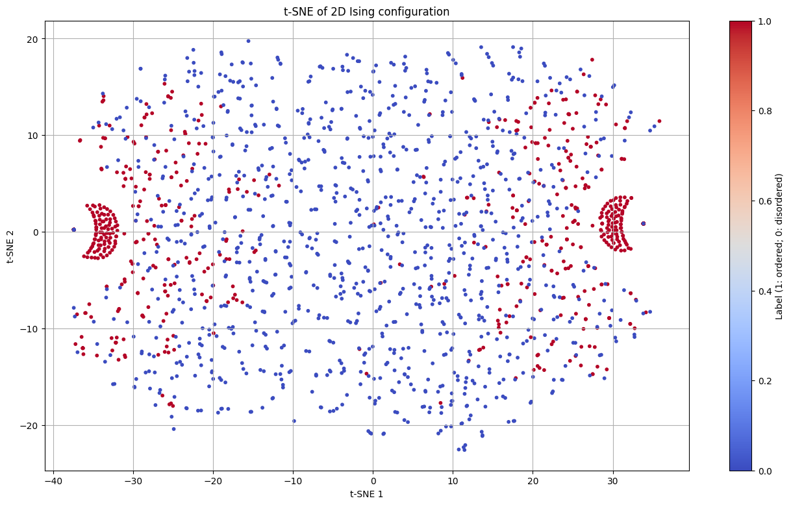

# Phase Classification of 2D Ising Model using Machine Learning

This project explores unsupervised and weakly supervised machine learning techniques to classify the phases (ordered/disordered) of the **2D Ising model** from spin configurations.

We apply the following techniques:

- PCA
- t-SNE + k-means
- Autoencoder
- Autoencoder + Triplet Loss

<p align="center">
  
  
</p>

---

## Try it in Google Colab

[](
https://colab.research.google.com/github/Hiromu-USHIHARA/IsingClassification2unsupervised/blob/main/demo.ipynb)

---

## Repository Contents

| File | Description |
|------|-------------|
| `isingclassification2.py` | Contains Ising model simulation (Metropolis method) and model definition |
| `demo.ipynb` | Google Colab-compatible notebook for demonstration |
| `images/` | Sample spin images and output graphs |
| `requirements.txt` | Library dependencies (not needed in Colab) |

---

## PCA

We begin with **Principal Component Analysis (PCA)**.

| PCA of 2D Ising Configuration |
|:--:|
|  |

- PCA shows weak separation between ordered (red) and disordered (blue) phases.

---

## t-SNE Visualization

We then use **t-distributed Stochastic Neighbor Embedding (t-SNE)** to embed the high-dimensional spin configuration into a 2D space.

| True label (1: ordered, 0: disordered) | t-SNE + k-means clustering |
|:--:|:--:|
|  |  |

- The left figure shows an ambiguous phase separation.
- The right figure shows the result of applying **k-means clustering** to the t-SNE embedded data.

---

## Autoencoder Latent Space

We train a basic **Autoencoder** to compress spin configurations into a 2D latent space.

| Autoencoder latent space 1 | Autoencoder latent space 2 |
|:--:|:--:|
|  |  |

- Blue: disordered, Red: ordered
- The latent space partially separates the phases.

---

## Triplet Loss (Weak Supervision)

We use **Triplet Loss** with weak supervision (only similar/dissimilar info) to improve feature learning.

| Triplet Loss Latent Space | t-SNE of Triplet Loss Latent Space |
|:--:|:--:|
|  |  |

- Triplet Loss produces a more structured and compact latent space.
- t-SNE reveals well-separated clusters in this space.

---

## How to Run

### 1. Requirements

Install required Python packages:

```bash
pip install numpy matplotlib scikit-learn torch tqdm
```

### 2. Run the script

```bash
python isingclassification2.py
```

---

## Project Structure

```
.
├── isingclassification2.py      # Main script
├── /images                      # Saved result images
└── README.md
```

---

## Acknowledgments

Inspired by:

- [Hiromu-USHIHARA/IsingClassification](https://github.com/Hiromu-USHIHARA/IsingClassification)

---

## License

This project is licensed under the MIT License.
